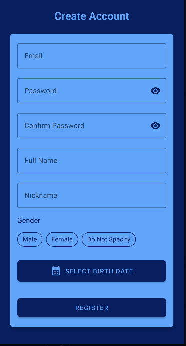
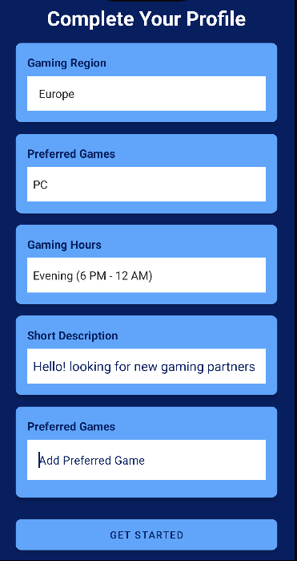

# Re-Match: Connect with Your Gaming Community

## 🎮 About Re-Match

Re-Match is an Android application designed to bring gamers together. Whether you're looking for a teammate for your next big match or just want to connect with fellow gaming enthusiasts, Re-Match has got you covered!

## 🌟 Features

- **🔐 Secure Authentication**: Register and login with ease using Firebase Authentication.
- **👤 User Profiles**: Customize your profile with gaming preferences region and more.
- **🔍 Advanced Discovery**: Find gamers who match your interests and gaming preferences.
- **👫 Friend Management**: Send friend requests, manage your connections, and grow your gaming network.
- **💬 Real-time Chat**: Connect instantly with your new gaming buddies through our sleek chat interface.
- **🛡️ Privacy Controls**: You're in control - choose what information you want to share.

## 🚀 Getting Started

 

### Prerequisites

- Kotlin 1.5.0 or later
- Minimum SDK: API 26 
- Target SDK: API 31 

## 🛠️ Built With

- [Kotlin](https://kotlinlang.org/) - Primary programming language
- [Android Jetpack](https://developer.android.com/jetpack) - Suite of libraries, tools, and guidance
- [Firebase](https://firebase.google.com/) - Backend and authentication
- [Dagger Hilt](https://dagger.dev/hilt/) - Dependency injection
- [Glide](https://github.com/bumptech/glide) - Image loading and caching
- [Material Design Components](https://material.io/develop/android) - UI design

## 📚 Architecture

Re-Match follows the MVVM (Model-View-ViewModel) architecture pattern, ensuring a separation of concerns and maintainable codebase.

## 🤝 Contributing

We welcome contributions to Re-Match! Please feel free to submit pull requests, create issues or spread the word.

## 📞 Contact

Gal Ogdan 

[https://github.com/galogdan/Re-Match]

## 🙏 Acknowledgements

- [Firebase](https://firebase.google.com/)
- [Android Developers](https://developer.android.com/)
- [Kotlin](https://kotlinlang.org/)
- [Material Design](https://material.io/)

